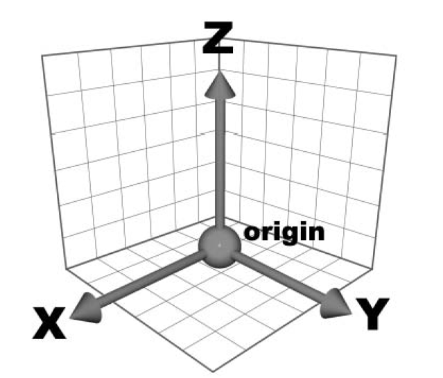

# ENROUTE CONTROLLER (CONTROLLER 1)

## Radar Separation Inside Bucharest ACC Airspace

### General

The minimum horizontal separation is 12 km (6 NM).

In order to enforce minimum horizontal separation, both aircraft must
not leave controlled airspace and the separation will apply to both
aircraft.

### Definitions

Separation is a generic term describing the action taken by air traffic
services to maintain a minimum distance between aircraft in order to
reduce the risk of collision. Separation is applied horizontally, either
longitudinally or laterally, and vertically. Vertical separation is
obtained by asking crews of aircraft to use a standard altimeter (QNH)
setting to operate at different flight levels or at different altitudes.

Required separation is described as the minimum distance on each axis of
the Cartesian system: vertical, longitudinal, and lateral. This is shown
in the diagram below:

The Y axis represents longitudinal; the X axis represents lateral and
the Z axis represents vertical.

Important

| Two aircraft are separated if **AT LEAST ONE** of these distances is
maintained. | **Any two aircraft must fall within one of the separation
cases to be properly separated.**

In the case of lateral separation, the minima are declared as a distance
in nautical miles (NM) and also in terms of angular difference measured
in degrees. Longitudinal separation is declared in units of time
(minutes) and also in units of distance (NM, DME distance, RNAV, ADS).
Vertically, the minima are declared in meters and feet or Flight Levels
(FL).

Distance between aircraft is measured from the end of the radar plot
symbol of the first aircraft and the end of the radar plot of the second
aircraft.

**Track** is the magnetic route of an aircraft.  
**Cruise flight**: An aircraft is in cruise flight if it maintains a
flight level and is on its own navigation.  
**Parallel Offset**: Flight on an offset tracking. The reference track
is considered a respective distance to the right or to the left.  
**Procedural Control (non-radar)**: Control based exclusively on
position reports of crews.  
**Radar Control**: Control based on position elements of an aircraft
displayed on a radar screen and where separation is done by maintaining
a specific horizontal distance (longitudinal and/or lateral) between
radar returns on a screen representing the aircraft positions in the
airspace.

### Abbreviations

**ATCO** - Air Traffic Controller Officer  
**NM** - Nautical Miles

Note

Relative tracks:

α - the angle between aircraft tracks  
**SS** - same route strict - α ≤ 10⁰  
**SA** - same route approximate - 10⁰ \< α ≤ 20⁰

## Minimum Radar Separation in Area Control

### Aircraft flying on the same route, in the same direction, in cruise flight

The **minimum longitudinal separation** between two aircraft flying on
the same route, in the same direction, at the same level, in cruise, is
10 NM when:

1.  The speed of the aircraft in front is greater or at least equal to
    the speed of the aircraft behind.
2.  The two aircraft are on the same route i.e. angle (α) between tracks
    is between 0° and 20°.
3.  The distance between aircraft is measured as in the diagram below:

The longitudinal separation in cruise flight shall be maintained by
using a combination of distance monitoring and speed control. All
flights shall be checked to ensure that at least 10 NM separation is
maintained at all times, using speed control as required to maintain
this.

The **minimum lateral separation** between two aircraft flying at the
same flight level, in cruise flight, on parallel tracks is 10 NM:

For two aircraft in cruise flight, on the same track, traveling in the
same direction, at the same level, the flying **parallel offset** should
be **laterally separated by a minimum** of 10 NM:

This separation may only be used after confirmation from the pilot that
the aircraft is properly equipped for **parallel offset**.

The **minimum longitudinal separation** between two aircraft flying the
same route, in the same direction, climbing or descending, at the moment
passing the occupied flight level, is 10 NM:

An **occupied flight level** is one where the Mode C altitude report on
an aircraft shows it is ±300 feet of the assigned flight level, after 3
consecutive radar returns.

This separation is only applicable for flights climbing/descending
passing the flight level occupied by an aircraft maintaining that level.
The approval to pass through that level will only be granted after the
aircraft has occupied a level below or above that aircraft (i.e. FL310
or FL350 in the case above). The ATCO will maintain radar longitudinal
separation until the aircraft is properly separated vertically.

### Convergence separation

The **minimum longitudinal separation** of two aircraft flying at the
same flight level or in climb/descent at the time passing the occupied
flight level, on convergent tracks, is 10 NM

The separation distance is measured relative to the convergence point.
Using the diagram above the separation is D2 - D1 (difference between
the distances from the convergence point).

If longitudinal separation of 10 NM between distances to the convergence
point is not established, then the **minimum lateral separation** of 10
NM must be established. The lateral distance must be at least 10 NM when
the aircraft are already on parallel or convergent tracks.

The lateral distance is measured between the position of the aircraft in
front and the track of the following aircraft (see diagram above).

### Divergent separation

The **minimum lateral separation** of aircraft flying divergent routes,
after the aircraft has passed the track intersection point, at the same
flight level, or in climb/descent at the moment passing the occupied
flight level, is 5 NM.

The distance is measured between the aircraft closer to the divergence
point and the track of the other aircraft.

This separation may only be used after the pilots report maintaining a
fixed heading.

The **minimum lateral separation** of aircraft flying divergent routes,
when one of the aircraft has passed the tracks intersection point, and
the other is flying toward the intersection point, in climb/descent at
the time of passing the occupied flight level, is 5 NM.

The lateral distance is the distance between the aircraft closest to the
divergent point and the track of the other aircraft.

Note

This separation may only be used after the pilots report maintaining a
fixed heading

### Aircraft on the same route, opposite direction

For aircraft flying the same route, at the same flight level or in
climb/descent, in opposite directions, before passing the intersection
point, non-radar separation is applicable. The non-radar separation for
each aircraft is 10 minutes from the point of intersection as shown in
the diagram below:

As this separation is not practical in high traffic situations, the ATCO
has the duty to seek alternative separation for aircraft looking to
climb/descend or provide vectors for a parallel track separation until
vertical separation is established.

For aircraft flying on the same route, in climb/descent, in opposite
directions, after it has been observed on the radar screen that the
plots have passed each other and it is a fact that the plots won't meet
each other again; the minimum longitudinal separation is 5 NM.

### Lateral radar separation minima for the time passing occupied flight level

The minimum lateral separation for aircraft on the same route, in the
same direction, in climb/descent, at the time of passing the occupied
flight level, is 5 NM. Headings assigned and confirmed by aircraft must
be parallel or divergent.

The minimum lateral separation or aircraft flying on the same route, in
opposite directions, in climb/descent, at the time of passing the
occupied flight level, is 5 NM. Headings assigned and confirmed by
aircraft must be parallel or divergent.

### Vertical separation

Vertical separation with two or more aircraft may be done simultaneously
in the following cases:

1.  Same route, same direction, if double vertical separation is assured
    and assigns a rate of climb and descent. ATCO must control the
    positions of the aircraft in the vertical plane to respect the
    separation required.
2.  Same route, same direction, and the minimum lateral separation of 5
    NM are respected.
3.  Same route, opposite direction, after passing, if it has been
    observed on the radar screen that the plots have passed each other
    and it is ensured that the plots will not meet again and the
    distance between plots is a minimum of 5 NM.
4.  Same route, opposite direction, and the minimum lateral separation
    of 5 NM are respected.

Aircraft in RVSM (Reduced Vertical Separation Minima) airspace are to be
separated by a minimum of 1000 feet vertically. Due to the setup of RVSM
airspace, aircraft flying in the same direction will be separated by a
minimum of 2000 feet and aircraft flying in opposite directions by a
minimum of 1000 feet. All aircraft outside of RVSM airspace shall be
separated by a minimum of 2000 feet.

### Circle of Intersection

The circle of intersection helps to determine if aircraft are on the
same route or flying in opposite directions by using the relative tracks
of the aircraft.

The relative track is the difference between tracks of two aircraft and
defines the movement of aircraft in the horizontal plane.

Note

SAS = Same route strict AAS = Same route approximate CA = Sharp
convergence CN = Normal convergence AC = Approximate convergence ASC =
Opposite direction approximate SSC = Opposite direction strict

Tip

> ROT 551 is flying on track 350° and BAW 036 is flying on track 300°. 
> Therefore, the relative track is: 350° - 300° = 50° [or 300° - 350° = -50°].
> From the circle of intersection chart, the two aircraft are normal convergence (CN).

