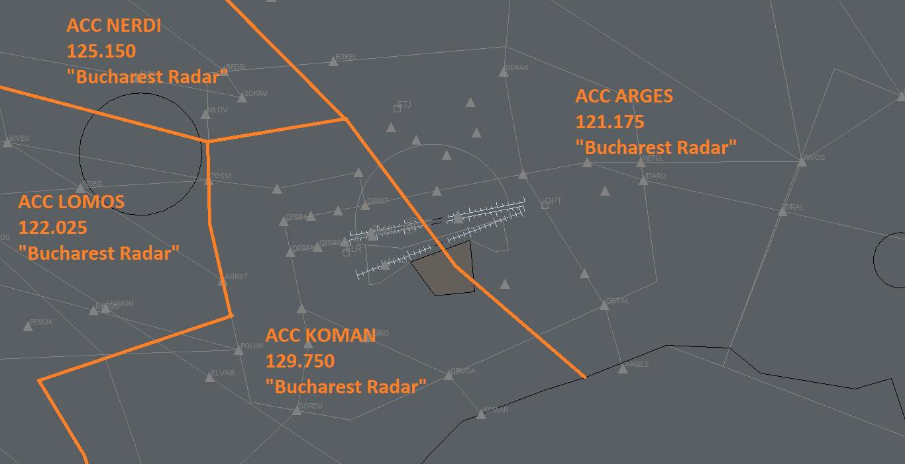
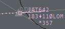
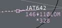
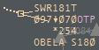
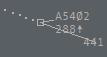

# APPROACH CONTROLLER (STUDENT 3)

## Position overview

As the name implies, Approach is responsible that aircraft when they
approach the airport. For arriving aircraft, the hand over point is
normally when the aircraft enters the STAR (Standard Instrument Arrival)
entry point. Approach is responsible that separation is made in a safe
way. In case the STAR doesn't end at the initial approach fix (final),
Approach is responsible for vectoring aircraft on to the final with
proper altitude and speed. Approach may also vector aircraft away from a
STAR or SID (Standard Instrument Departure) if this is necessary for
safety reasons, or to get a good traffic flow.

Normally Approach also handles departure's responsibilities, taking care
of departing aircraft which are handed over to Center Control. Arriving
aircraft are usually handed over to Tower when they have established ILS
(Instrument Landing System) or when on final for visual approach.

Bucharest Approach have under control TMA Bucuresti airspace which is
classified as class A airspace where only IFR flights and SVFR are
permitted. The vertical limits on TMA Bucuresti are 2000ft-FL175 with
mention that in north of TMA vertical limits are between 4500ft and
FL175 because of higher elevation and other activities in that area.
Below this limits is class G uncontrolled airspace excluding CTRs which
are under tower control. In airspace you have to control all IFR flights
with are departing or arriving at Otopeni and Baneasa and also flights
with just cross the airspace at an altitude between 2000ft/4500ft and
FL175. Your main objective as approach controller is to maintain the
separation between aircraft and to ensure them a safe departure, arrival
on crossing of the airspace and then we can talk about efficiency and
economy of the airlines. In all TMAs from Romania the horizontal
separation is 5nm and vertical separation 1000ft. You have to find the
potential conflicts from time and to avoid them before is already too
late. The transition altitude is 4000ft and the transition level is set
by ATC but generally is FL050. Also when the local QNH is greater than
1013 hPa you should avoid to descending aircraft to FL50 because
vertical separation between an aircraft at FL050 on standard QNH
(1013hPa) and an aircraft at 4000ft on local QNH is less than 1000ft.

Bucharest Approach uses the Callsign LROP_APP and transmits on
frequency 118.250. It's full radio Callsign is “Bucharest Approach”.
When the main frequency is serviceable it will be used alternative
position with Callsign LROP_A_APP transmitting on frequency 120.600
with the same radio Callsign: “Bucharest Approach”.

You have to handoff aircraft to the tower position when aircraft are
establishing on ILS or if is on visual approach when they have runway in
sight. You also have to know that coordination with tower is mandatory.
You should coordinate with tower twice for each aircraft. First time
when an aircraft is entry your airspace mentioning the Callsign of
aircraft, arrival runway and if it is possible estimate time until
final. The second coordination should be when aircraft is established on
ILS or for visual when they have runway in sight, so exactly before
handoff to tower position, mentioning that aircraft is on final. The
handoff to radar position should be done until aircraft leave your
airspace on horizontal or vertically. You have to know which radar
position you should handoff the aircraft. In real life in low traffic
situation sectors NERDI, LOMOS and KOMAN are working like one sector
only named KONEL which use the frequency of LOMOS 122.025 and sector
ARGES and DINSI are also working like one sectors which use frequency of
ARGES 121.175. So then you have one sector for aircrafts witch leave
your airspace to west and other sectors for aircrafts witch leave your
sector to east. On VATSIM in most of the time is only one radar position
which cover all radar sectors in Romania and that is LOMOS on 122.025.
You also can coordinate anytime with a radar position for any aircraft
using the voice/text communication but also electronic coordination
using tools from Euroscope.

When you log in into Bucharest Approach you should coordinate with Tower
position (if is online) to know the active runways and also to select
them in Euroscope. The main runways which should be use at Otopeni are
08L and 08R with are equipped with CAT III ILS approach in case of LVO
and also ensure a short taxi route for departing the aircraft and a
short approach for aircraft with comes from west (the most of them). So
when the wind is calm and also even if is light wind favorable for
runway 26L/R (till 6-7kt) you have to use runways 08L/R as active. So in
most of the time, in normal conditions, when active runways are 08L/R
the both runways are used for arrivals and departures. When active
runways are 26L/R is recommended to use runway 26R for departures and
runway 26L for arrivals. The active runways can be dependent on local
restriction which can be found in NOTAM.

In most of the time conventional SIDs and STARs are suspended so only
RNAV procedures in use. If one aircraft is not able for RNAV he will
receive vectors. So if active runway is 08 will be used U arrivals/K
departures and if runway 26 is active will be used X/R arrivals/M
departures.

Because this is a radar position all your actions should be focused on
tag of the aircraft. You have to assume aircraft when they are on your
frequency and you have control of them. So when you receive the handoff
pop-up for an aircraft you have to assume the tag only after the pilot
contacts you. If an aircraft was just handoff to you and he is not
crossing your airspace and should be with other controller you have to
refuse the tag immediately and if is necessary to tell to the controller
to which position should handoff the aircraft. In images below you have
all necessary explanations for ROMATSA tags.

**TAG Information**

*The pink tag mean that aircraft is not in your airspace but will be
soon.*

*This pink tag with white callsign mean that you recive an handoff from
other contoller.*

*The yellow tag mean that aircraft is assumed by you and you have full
control for him.*

*The yellow tag with pink callsign mean that you initiate a handoff to
next contoller.*

*The grey tag mean that aircraft is not in your airspace and also he
will never cross you airspace.*

*The grey tag with squawk code instead of callsign mean that the tag in
uncorelated.*

*The grey line without tag mean that tha aircraft have transponder on
standby but is recived by a primary radar.*

This is the ROMATSA tag's structure:

CALLSIGN  
CURENT ALTITUDE - VERTICAL SPEED INDICATOR (UP/DOWN) - CLEARED ALTITUDE
- HANDOFF POSITION/POSITION WITCH HAVE TAG ASSUMED  
SECTOR EXIT ALTITUDE (USED FOR COORDONATION) - ASTERIX - GROUND SPEED  
CLEARED HEADING/DIRECT - CLEARED SPEED

Now we describe the operational mode of ROMATSA tags. When you use
left-click on **CALLSIGN** you open the handoff pop-up menu and
right-click will show you the drawn route for aircraft. Using left-click
on **CURENT ALTITUDE** or **VERTICAL SPEED INDICATOR** and **CLEARED
ALTITUDE**, if appear, you open the cleared altitude menu. Using
right-click on **CURENT ALTITUDE** will show you drawn route with
expecting altitude and handoff positions. If the next controller
position is not correct you can change it using left-click on position
indicator. If you use left-click on **SECTOR EXIT ALTITUDE**, you will
open COPX altitude menu where you can coordinate level changes with
other positions. **ASTERIX** is operable only on right-click and will
open a text box where you can put a way point for direct or any remarks.
If you use left-click on **CLEARED HEADING**, you can set assigned
heading and if you press right-click you can write a way point for
direct. Using left-click on **CLEARED SPEED** you can set assigned speed
restriction in IAS and using right-click you will set assigned speed in
mach.

Besides using the tag, you also have to work with “Sector exit list” and
“Sector inbound list”. These are very useful tools in Euroscope for
operable radar positions. In Sector inbound list you can see aircraft
which will cross your airspace. The aircraft are ordered by estimate
time to entry in your airspace. In “Sector inbound list” you can see for
each aircraft the Callsign, the position which control the aircraft,
entry point end estimate time and flight level and also the exit way
point and estimate time. From that list you can send electronic
coordination for entry points and entry flight level. In “Sector exit
list” you can see aircraft which are under your control which are
ordered by cleared flight level to see if you have two aircraft or more
at the same altitude and prevent a conflict easier. In that list you can
see for each aircraft the Callsign, the cleared flight level, exit point
and estimate time, COPX flight level and for aircraft landing in your
airspace you have to select the runway and star (if necessary) for
arrival.

## Duties

We take a flight from airbone to handoff to ACC position and backward.

We supose **DLH1CF** is flying from Bucharest Henri Coanda to Munich:

> **Pilot**: Bucharest Approach, good evening, DLH1CF airbone runway
> 08R, passing 2500ft.
> 
> **ATC**: DLH1CF, good day, Bucharest Approach, radar identiefied,
> continue SOKRU1K departure, climb FL280.
> 
> **Pilot**: SOKRU1K, climb FL280 DLH1CF.

*Note: The upper extract is only an example. From initial contact to
handoff to Bucharest Radar you can give anytime radar vectors using
heading or direct to, to change cleared altitude or to give speed
restrictions. You have to do this to ensure a quickly crossover of your
airspace for aircraft, but in the same time to ensure a safety departure
or arriving avoiding conflicts between aircraft. In next extract you
have used phraseology for radar vectors, altitude change and speed
change:*

  - DLH1CF, turn left heading 290.
  - DLH1CF, proceed direct SOKRU/turn left direct SOKRU/cleared direct
    SOKRU.
  - DLH1CF, climb FL360/stop climb at FL070/continue climb FL280.
  - DLH1CF, reduce speed 220kt or less/maintain speed 240kt/no speed
    restrictions/free speed.

If in a transmission to pilot you have to give more than one of this
according to vectors, altitude and speed clearance you have to respect
this order: HAS (heading, altitude, speed). Example: DLH1CF, direct to
SOKRU, climb FL360, no speed restrictions.

Because for aircraft this is first contact with a radar position you
have to check if squawk is set corrected and if tag is correlated and
set to right aircraft and after that to say “radar identified”.

Also tower will coordinate with you and will tell you he has an aircraft
which will depart from one runway. You have to respond to him and to
clear the takeoff. If traffic is not permitting this, you tell to tower
instructions after departure for departing aircraft or if the traffic is
not permitting at all you tell to tower to wait with takeoff clearance.

You also have to know transition altitude. For example, transition
altitude at Otopeni is 4000ft, when you climb and aircraft to 4000ft is
on altitude and he must be on local QNH but if you want to climb him
above he will be on level and will set QNH on STD mode. You don't have
to announce this to them, as they already should know this.

> **ATC**: DLH1CF, contact Bucharest Radar 122.025, have a nice flight,
> good bye\!
> 
> **Pilot**: Bucharest Radar on 122.025, good bye, DLH1CF.

*Note: You have to handoff the aircraft to Bucharest Radar before
reaching FL175 and to ensure some time to contact radar until aircraft
reach FL175. The best moment to handoff the aircraft to radar is when
this pass FL150, but this depend by aircraft performance.*

We supose **ROT3VR** is flying from Barcelona to Bucharest Henri Coanda:

> **Pilot**: Bucharest Approach, good evening,ROT3VR inbound TOSVI
> decending FL110.
> 
> **ATC**: ROT3VR, good day, Bucharest Approach, radar contact, follow
> TOSVI2U arrival for ILS approach runway 08R, decend FL070.
> 
> **Pilot**: TOSVI2U arrival for ILS 08R, decend FL070.

*Note: This is first contact with the aircraft. You have to check if
aircraft is correlated and appear on radar and to confirm that saying
“radar contact”. Then you have to give the instruction to the aircraft
in the following order: HAS (heading, altitude, speed) and also the
arrival runway and type of approach. If you give to aircraft a STAR, you
tell him arrival runway and approach type just after STAR name and then
continue with altitude to descend and speed restriction if is needed. If
you give radar vectors to aircraft tell him “radar vectors
for...approach type and runway” at the end of instruction HAS.*

Example:

  - Follow STAR arrival for approach type and runway, descend x,
    maintain speed x. - for STAR.
  - Fly heading x, descend x, maintain speed x, radar vectors for
    approach type and runway - for vectors

Also here you have to coordination with tower: “Tower, ROT3VR entry at
TOSVI for ILS08R in about ten minutes on final”

> **ATC**: ROT3VR, direct OBELA, decend 4000ft, qnh 1028.
> 
> **Pilot**: Direct to OBELA, decend 4000ft, qnh 1028.

*Note: From initial contact to handoff to Otopeni Tower you can give
anytime radar vectors using heading or direct to, to change cleared
altitude or to give speed restrictions. You have to ensure a quickly
crossing of your airspace by aircraft but also to avoid conflicts
between aircraft. If you want to create a quickly route for aircraft
using direct to... and if the aircraft is on STAR, you have to direct
him to points which are on STAR route only. If aircraft is on vectors
you can direct him to any point in your airspace but also you can use
headings. In next extract you have used phraseology for radar vectors,
altitude change and speed change:*

  - ROT3VR, turn right heading 110.
  - ROT3VR, proceed direct OBELA/turn right direct OBELA/cleared direct
    OBELA.
  - ROT3VR, turn right/left by 5 degrees.
  - ROT3VR, descend FL060/stop descend at FL080/continue descend 4000ft.
  - ROT3VR, reduce speed 220kt or less/maintain speed 240kt/no speed
    restrictions/free speed.

If airport is closed or is too busy you can put aircraft in holding. The
best way for that is to use standard holding points which you can find
on STAR charts. example: DLH1CF, hold over UVALU.

If is a standard holding point is not mandatory to say the side of
holding, but if you give another way point for holding you have to
mention this. example: DLH1CF hold over TUTIX on left side. You also can
mention more information for pilot like: altitude for hold, time to
hold, etc.

You also have to know transition level. For example, if transition level
is FL050, when you descend and aircraft to FL050 is on level but if you
want to descend him below you have to say feet and also to give local
QNH to aircraft. If the local QNH is greater than 1013 you have to avoid
descending aircraft to FL050 because between an aircraft at 4000ft (on
local QNH) and an aircraft at FL050(on standard QNH) is less than 1000ft
and this means that vertical separation is not ensured.

Also you have to coordinate with tower and to tell him for each aircraft
the type of approach and the runway you give it and also the time until
he is on final. Also you can coordinate again with the tower before
handoff and to announce him the aircraft is on final and again the
runway. In this mode tower and ground control know how to manage their
traffic.

You can announce pilot which order number they have for landing.

Example:

  - ROT3VR you are number two for ILS approach 08R / you are number two
    for landing. That helps you because pilots know how to adjust speed
    to approach and that help to separation between aircraft.
    
    > **ATC**: ROT3VR, decend 2500ft, clear for ILS approach runway 08R.
    > 
    > **Pilot**: 2500ft, clear ILS 08R.

*Note: The most used type of approach at Otopeni is ILS. The altitude to
intercept ILS is 2500ft but if the traffic needs can be also 3000ft. To
intercept localizer correctly you have to bring aircraft to FAP (Final
Approach Point - Ex: OBELA for 08R) at an angle of 30 degrees by runway
axe. For example, if an aircraft is coming from North-West for ILS
runway 08R he has to come to OBELA on heading 110. It is not a problem
if this component varies a bit.*

If aircraft request visual approach vectors you have to vector him to
the runway on axe of the runway and ask him to report when have runway
in sight and then to handoff him to tower. Also for ILS approach you can
ask pilot to report localizer establish or full establish on ILS that
means also localizer and glide slope intercepted. After the aircraft is
establish on ILS you have to coordinate with tower: “Tower, ROT3VR is
established on ILS 08R”

> **ATC**: ROT3VR, contact Otopeni Tower 120.900, good bye\!
> 
> **Pilot**: Otopeni Tower 120.900, good bye\!

*Note: The moment of handoff to tower should be when aircraft is
establishing on ILS or if is a visual approach when he has runway in
sight. As phraseology you can tell to aircraft “radar services
terminated” because next position is not a radar one, but this is not
mandatory.*

## Efficient Arrival/Departure within TMA

In these images you have some efficient tips for efficient arrivals in
TMA Bucharest for LROP for runway 08 and 26 in use:

*These arriving tips can be used after aircraft follow the STAR until
the shortcut point.*

For departure aircrafts, with exception of POLUN1K departure where you
have to wait until aircraft reach FL105, you can proceed them direct to
TMA exit point just after departure.

These efficient arrivals and departure will be used only when traffic is
permitting.

## Procedural Approach

Procedural approach services are used at airports which because of radar
equipment availed are not able to provide a safe radar vectors service.
In Romania procedural approach serviced are in use at Bacau(LRBC), Baia
Mare(LRBM), Craiova(LRCV), Iasi (LRIA), Oradea(LROD), Sate Mare(LRSM),
Sibiu(LRSB), Suceava(LRSV), Targu Mures(LRTM) and Tulcea(LRTC). At these
airports all services, from ground to approach, are provided by the
tower position which used only a frequency. You will receive the
arriving traffic from radar position inbound the CTR entry point and
descending to minimum airway altitude specified on the airport charts.
Then you have to give to the aircraft the arrival approach procedure and
also a STAR if is available and to descend him to minimum approach
altitude. When aircraft is on arrival procedure you can ask him any time
about position, altitude, speed and so on, information which can help
you separating aircrafts. After the aircraft report on final (ILS
establish/runway in sight) you can provide regular tower and ground
services. For departing aircraft, ground and tower services are regular
and after departure you have to climb aircraft to minimum airway
altitude which aircraft is following after leaving your airspace and to
let him to follow the SID. If is not any SID available, you have to give
him runway heading after departure and then when he passes over a safe
altitude you can proceed him direct to the exit waypoint. To know his
altitude, you have to ask him or to give instruction like “report
passing 2000ft”. Also when he reports approaching minimum airway
altitude you can handoff him to the radar position. The problem with
procedural approach is because of safety you can't have two
arrival/departing aircrafts at the same time in the airspace. So for
arrival aircrafts the second aircraft will hold at the entry point and
for departing aircraft, the takeoff clearance to the second aircraft
should be given after first aircraft is handover to radar position. If
you have a VFR traffic which cross your airspace when you have a
departing or arriving traffic you have to keep him at an altitude below
that IFR aircraft is descending to intercept localizer and also to keep
runway axes cleared of the VFR.

In the next paragraph you have examples for a procedural approach
arrival or departure from Bacau (LRBC) airport:

We supose **BMS231** is departing from Bacau to London-Luton:

> **Pilot**: Bacau Tower, good day, BMS231 on stand 3 at Bacau request
> IFR clearence to Luton.
> 
> **ATC**: BMS231, good day, Bacau Tower, you are cleared to
> London-Luton, via INBID departure, climb initial FL60, sq 5431.
> 
> **Pilot**: Cleared to Luton, INBID vectors departure, climb initial
> FL060, sq5431.
> 
> **ATC**: Readback is corect.
> 
> **Pilot**: BMS231, we are ready for push and start.
> 
> **ATC**: BMS231, you are clear for push and start, qnh 1017.
> 
> **Pilot**: push and start approved, BMS231.
> 
> **Pilot**: Ready for taxi, BMS231.
> 
> **ATC**: BMS231, taxi holding point C, rwy34 via C.
> 
> **Pilot**: Via taxiway C to holding point runway 34.
> 
> **ATC**: BMS231, backtrack runway 34 Pilot: Backtrack 34, BMS231.
> 
> **ATC**: BMS231, wind is 330 with 4kt, you are cleared for takeoff
> runway 34, mentain runway heading.
> 
> **Pilot**: cleared for takeoff rwy 34, on runway heading, BMS231
> 
> **Pilot**: BMS231, airbone ATC: BMS231, roger, continue on runway
> heading, report passing 3000ft.
> 
> **Pilot**: continue on runway heading, will report 3000ft, BMS231.
> 
> **Pilot**: passing 3000ft, BMS231.
> 
> **ATC**: BMS231, roger, turn left direct INBID, climb FL120, report
> pasing FL100.
> 
> **Pilot**: BMS231, direct INBID, climb 120, report 100.
> 
> **Pilot**: BMS231 is pasing FL100.
> 
> **ATC**: BMS231, now contact Bucharest Radar on 127.900, good bye\!
> 
> **Pilot**: 127.900, bye\!

We supose **BMS234** is arriving at Bacau from Liverpool:

> **Pilot**: Bacau Tower, good day, BMS234 decending to FL100
> approaching BUCSA.
> 
> **ATC**: BMS234, good day, Bacau Tower, follow BUCSA4A arrival for ILS
> approach runway 34, decend at 2600ft by qnh 1024, report ILS
> extabilish.
> 
> **Pilot**: BUCSA4A for ILS runway 34, decend 2600ft by qnh1024, will
> report on ILS, BMS234.
> 
> **Pilot**: BMS234, on ILS runway 34.
> 
> **ATC**: BMS234, wind is 320 with 6kt, you are cleared to land runway
> 34, vacate on taxiway C.
> 
> **Pilot**: wind copied, clear to land runway 34, we vacate on C,
> BMS234.
> 
> **Pilot**: BMS234, runway 34 vacated on taxiway C.
> 
> **ATC**: BMS234, roger that, welcome to Bacau, taxi to stand number 3
> via C.
> 
> **Pilot**: Via C to stand 3, BMS234.

| Date       | Changes         |
| ---------- | --------------- |
| 13.03.2016 | Initial release |

