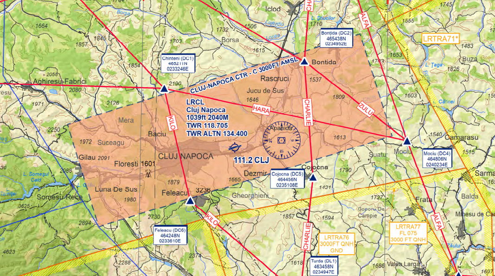
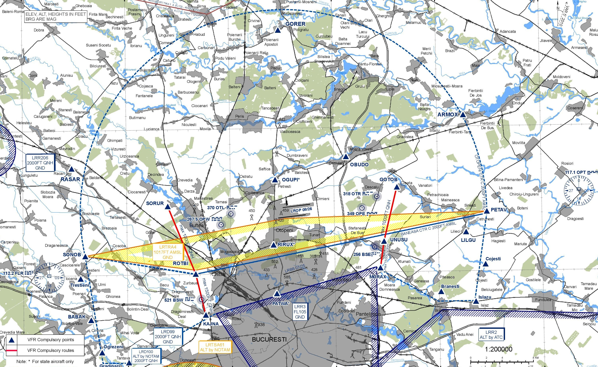
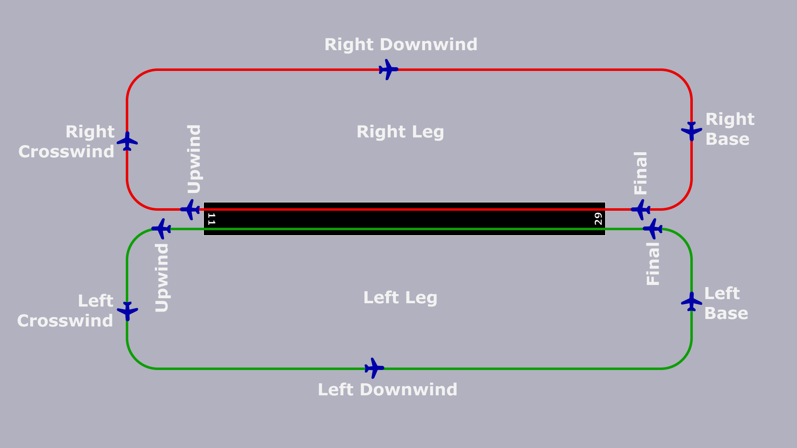

# Tower CONTROLLER

**  **

Approved by George Enciu, vACC Director

**  **

Created by Teodor G Petrică, OPS

**  **

## 1. Position overview

The Tower is generally responsible for all movements on the runways and within the control zone (CTR). It also determines the direction of operation at the airport. Different or additional tasks are described in the respective airport SOP.
 
In addition to safely handling air traffic, it is essential to work efficiently when there is a high volume of traffic. The pilot principle also applies here: "Safe, orderly and expeditious", i.e. first and foremost safe, but immediately afterward orderly and smoothly (efficient).

## 2. Tasks

### 2.1. Setting the Operation Direction

The Tower determines which runway is used at an airport. This is primarily determined by the prevailing wind (direction and strength), which can be determined using METAR and TAF. If local peculiarities must be taken into account (e.g. maximum tailwind components for a runway). For instance, the maximum tailwind component at LROP is 7 knots; at LRTR is 12 knots.

Aircraft prefer to take off and land against the wind. The name of the runway indicates the direction in which it is pointing according to the heading. Runway 08L in Bucharest Otopeni therefore points 079° towards the east. The opposite direction, runway 26R, is rotated by 180° and points 259°, which is approximately towards the west. The wind direction in the METAR indicates the direction from which the wind is coming. If the wind is coming from 260° (west), for example, runway 26R is used to be able to take off and land with a headwind. If the wind is not coming directly from the direction in which a runway is pointing, the one where the headwind component is greatest is used.

The active runway(s) are published via the ATIS, whenever this station is available.

_Remarks_

The **operating direction** should not be confused with the **operating mode**. 

The operating mode is a term that describes how the selected runways are controlled. Each airfield has a variety of options. In addition to standard operation, an airfield can be operated for Low Visibility Operations (LVO), for example, in order to maintain flight operations even in bad weather. 

At larger airfields with parallel runways, such as LROP, there are several possible ways of using them. Typically, LROP operates under "Segregated Parallel Dependent" runways operations, meaning one runway is generally used for departures and the other for arrivals, in which, for example, radar separation from the parallel runway must be maintained on the approach. Despite LROP having two runways, all other airfields have only one runway in operation. Therefore, a "Mixed Mode" is generally used at these airfields, where the same runway is used for both departures and arrivals.

### 2.2. Taxi Movements in the Runway Area

The main area where a Tower service is runway. Tower is authorized to issue clearances for taxiing (lineup), crossing, backtracking, and finally taking off and landing. It is always important to maintain correct runway separation. In addition to a standard lineup clearance, a conditional clearance can also be used to optimize frequency efficiency. If the runway is immediately clear for departure, the lineup clearance can be skipped, and a direct takeoff clearance can be issued (see below).

### 2.3. Establishing the Sequence

The Tower typically receives departing aircraft from the Ground controller in a random sequence, usually just before reaching the holding point of the active runway. If another runway must be crossed on the way to the active runway, the handover can occur earlier. 

In air traffic control, the "first come, first served" principle generally applies. This means that the first aircraft at the runway is allowed to take off first. However, the Tower may deviate from this principle to minimize average delay.

The arrival sequence, on the other hand, is predetermined for IFR traffic as the aircraft in the final approach are handed over by the Approach controller, and the Tower cannot alter this sequence. However, the Tower has authority over VFR traffic and can, for example, determine which VFR aircraft should fit into which IFR gap. Additionally, the Tower can establish a landing sequence for multiple VFR aircraft.

### 2.4. Clearance for Takeoffs and Landings

The most well-known clearances in the Tower area are takeoff and landing clearances. Here, too, the rules for runway separation must be ensured. In the S2 training, the practice of not withholding a takeoff or landing clearance is also noteworthy. If necessary and conditions are met, reduced runway separation can be applied.

Takeoffs must also be timed so that either radar separation, wake turbulence separation, or a certain minimum spacing is ensured in the air. For more details, refer to the paragraph "Separation in the Tower Area" below.

At most airports, a separate transfer of communication is necessary once the aircraft is airborne.

An arriving aircraft can be cleared to land as soon as no other aircraft has a clearance for the same runway and runway separation is ensured.

### 2.5. Handling Missed Approaches

A missed approach or go-around can be initiated either by the controller or the pilot. As a Tower controller, it is important not to panic in such situations. The procedure for handling a missed approach is described below.

First of all, **a controller must assume that a pilot can make a missed approach at any time up to and including touchdown**! There must always be a plan B in the event of a missed approach. 
 
From the controller's point of view, a missed approach should not be handled hectically, even in stressful situations, but rather according to a clear plan. These steps are now explained in detail:

1. Instruct a missed approach (only if initiated by the controller)
    - Since an instructed missed approach is usually safety-critical, the controller should raise their voice on the frequency and give a clearly audible `ROT123 go around`, if necessary twice in a row
    - A reason should be given briefly and concisely (e.g. `ROT123 go around, traffic on runway`)

or

1. Acknowledge missed approach (only if initiated by the pilot)
    - When the pilot reports that they is about to go around, this should be acknowledged with a `ROT456, Roger`. The instruction to fly the published missed approach is not necessary, as this is part of the approach procedure for which the pilot has been cleared
    - Since the first few seconds after initiating a missed approach are very stressful in the cockpit, especially in the one-person VATSIM cockpit, no further radio messages should be sent to the pilot - with the exception of instructions relevant to separation (see point 2).

2. If necessary, ensure/establish traffic information + separation
    - In most cases, a pilot can fly the standard missed approach procedure. However, if the missed approach comes close to another aircraft - regardless of whether separation is always present or not - a traffic information should be given

3. Coordination with Approach / other stations
    - Every missed approach must be coordinated with the approach controller (if online). Verbal coordination should always be preferred, as pure labeling often gets lost in the tag.

4. Ask the pilot why and send them away
    - If the reason for the missed approach was not obvious (e.g. because it was instructed by the controller), the pilot should be asked (`HYS109, report the reason for the missed approach`). The reason may be relevant for other air traffic (e.g. wind shears - this information should definitely be passed on to subsequent pilots) or it may be of a technical nature (e.g. problems with the engine, landing gear, etc.), which means that the aircraft should be treated as a priority for the next approach / in an emergency situation as an emergency.
    - As soon as the aircraft is free of conflict with all other traffic and some time has passed since the missed approach was initiated, the aircraft is sent away to the approach controller.

5. Pass on reason to APP
    - As mentioned above, there can be many reasons for a missed approach, which are also important for the approach controller to know. Therefore, the reason should be passed on to the APP controller so that he does not have to ask the pilot again unnecessarily

### 2.6. Control of VFR Traffic Within the Control Zone

The Tower controller is responsible for the entry and exit of VFR traffic into and out of the control zone, issuing the necessary clearances. Since VFR traffic is not subject to mandatory separation from each other, traffic information must be provided if two aircraft are approaching each other. Additionally, the Tower has the ability to delay VFR traffic within the control zone as needed, using methods such as holding patterns, extending the downwind leg, or establishing a landing sequence. The Tower also clears VFR traffic for various training approaches, such as low approaches or touch-and-go.

All aspects of VFR handling are covered in the "VFR Operations" chapter below.

### 2.7. Monitoring Separation

IFR traffic must be separated from other IFR traffic within the control zone. Therefore, the Tower is responsible for ensuring separation between two IFR aircraft, including departures, arrivals, and missed approaches relative to other traffic.

For departures, the Tower controls the timing of takeoff clearances to ensure aircraft are properly separated.

Approach controllers hand over arriving aircraft in a way that typically does not require the Tower controller to intervene. However, there may be instances where a pilot unexpectedly reduces speed early, causing the following aircraft to close the gap. In such cases, the Tower must monitor separation and, if necessary, instruct a go-around to maintain safe distances.

In the event of a missed approach, the Tower must also ensure separation from other aircraft. For detailed information on separation in the Tower area, refer to the "Separation in Tower Area" paragraph below.

## 3. Separation in the Tower Area

As a Tower, you are responsible for the departure sequence and the distances between departures. It will certainly take a while until you develop a feeling for how long you have to wait between two departures to get the desired distance. 

Between two departures that require separation, you must now calculate the largest value from:
- Radar separation (generally 3 NM): Radar separation is therefore always the minimum between two IFR aircraft. 
- Wake Vortex Separation (4 - 8 NM): Depending on the category of wake turbulence, you also have to  take wake turbulence separation into account. 
- Departure Spacing (individual values): Sometimes local procedures require more distance than the spacing actually requires. One example is departures on the same SIDs: An  additional requirement for departure spacing at most airports is that identical SIDs in a row need at least  5 NM.

While separation always describes the absolute minimum, spacing is a value that is always greater than or equal to the gradation minimum and includes an optional surcharge.
 
Expressed mathematically: `Spacing = minimum gradation + optional surcharge`

In individual cases, the Approach or Centre controller can also specify departure spacing if the airspace is very full. In this case, an MDI (minimum departure interval), usually expressed in minutes, can also be imposed. For example, if it says `MDI SOKRU 6 Minutes`, the Tower controller can only allow all departures to SOKRU to take off with an interval of 6 minutes.

Always consider the different speeds during takeoff. If you have a C150 in front and an B744 behind on a different SID, you could theoretically do 3 NM. It should be logical that this makes no sense, as the B744 flies at least twice as fast as the Cessna light traffic and therefore at 3 NM a separation violation occurs shortly afterwards. In such cases (rear departure significantly faster than front departure) it is advisable to let the fast traffic take off as number 1 and thus reverse the departure sequence.

Handling the approaches for you as a Tower controller is quickly explained. You receive the approaching aircraft from the approach controller approximately 8 - 12 NM from the runway. If you have approaching traffic on your frequency, you should give them clearance to land as quickly as possible. If an approach is coming and you have no departing traffic, you should give them clearance to land directly on the initial call. The pilot must have received their landing clearance before crossing 1 NM final at the latest. If they do not have clearance there, a go-around will take place independently. 

The Approach controller is responsible for the separation between approaches until the runway threshold is crossed.

If two approaches are so close that there is a risk of a separation violation, you must instruct one of the aircraft (usually the one behind) to make a missed approach **before** the separation violation occurs. In addition, traffic information about the traffic in question can be useful. 

### 3.1. Radar Separation

The following table provides an overview of the radar separation obligation:

|             | controlled       | uncontrolled  |
|-------------|------------------|---------------|
|             | C                | G             |
| **IFR**     |                  |               |
| separation  | to IFR/VFR       | procedural    |
| traffic info| not required     | if possible   |
| speed limit | M.99             | 250 kts       |
| on freq     | mandatory        | recommended   |
| clearance   | required         | not required  |
| **VFR**     |                  |               |
| separation  | to IFR           | none          |
| traffic info| VFR              | if possible   |
| speed limit | 250 kts below FL100 | 250 kts    |
| on freq     | mandatory        | night time    |
| clearance   | required         | not required  |

In other words, there is a radar separation obligation between:
 
- all flights in airspace A and (B - does not apply in Romania)
- IFR to IFR in airspace C, (D and E - does not apply in Romania)
- IFR to VFR (and vice versa) in airspace C
- Special VFR to IFR in the control zone

The following vertical separation must be applied between two aircraft subject to separation:

| Altitude band    | vertical separation | Remarks                            |
|------------------|---------------------|------------------------------------|
| FL410 - UNL      | 2000 FT             |                                    |
| FL290 - FL410    | 2000 FT             | under CVSM (exceptional case)      |
| FL290 - FL410    | 1000 FT             | under RVSM (standard case)         |
| GND - FL290      | 1000 FT             |     -                              |

The following lateral separation must be applied between two aircraft subject to separation:

| Altitude band    | lateral separation          | Remarks        |
|------------------|-----------------------------|----------------|
| FL105 - UNL      | 7.5 NM (not less than 5 NM) | outside of TMA |
| GND - FL175      | 5.0 NM (not less than 3 NM) | within TMA     |

Formation flights must be spaced 1 NM further than the required minimum distance from other traffic. Two formation flights must be spaced 2 NM further than the required minimum distance from each other.

### 3.2. Wake Vortex Separation
Wake turbulence separation is used in areas where wake turbulence is expected. 

* Between aircraft with separation obligation (see radar separation ), if:
- an aircraft is directly behind an aircraft flying ahead at the same altitude or less than 1000ft below
- an aircraft directly behind another aircraft, at its 6 o'clock position, crossing at the same altitude or less than 1000 ft below

* Between aircraft in the approach or departure phase of the flight when:
- an aircraft is directly behind an aircraft flying ahead at the same altitude or less than 1000ft below
- an aircraft directly behind another aircraft, at its 6 o'clock position, crossing at the same altitude or less than 1000 ft below
- both aircraft use the same runway or parallel runways less than 760m apart
- the aircraft use intersecting or parallel runways (separated by 760m or more) and one aircraft traverses the flight path of the aircraft ahead at the same altitude or less than 1000ft 

Wake turbulence separation does not apply in the following cases:
- incoming VFR flights
- approaching IFR flights conducting a visual approach, have reported the aircraft ahead in sight and have been instructed to follow it and maintain separation 

In these cases, a wake turbulence warning (CAUTION WAKE TURBULENCE) must be issued.

**Departure phase**

A VFR flight is in the departure phase between take-off and 
- to reach 1000ft above airfield level or
- to achieve horizontal flight or
- to enter the (right) downwind approach

**Approach phase**

A VFR flight is in the approach phase when it is at or below 1000ft above airfield level and until landing:
- has flown into the traffic pattern or part of it or
- has begun the final descent within a control zone

### 3.2.1. Wake turbulence categories

For this purpose, aircraft are divided into four wake turbulence categories (WTC) according to their maximum take-off mass (MTOM). 

| Wake turbulence category | TOM              |
|--------------------------|------------------|
| Light (L)                | MTOM ≤ 7t        |
| Medium (M)               | 7t < MTOM < 136t |
| Heavy (H)                | MTOM ≥ 136t      |
| Great (J)                | A388; A225       |

Of course, you don't need to know how heavy each aircraft is. In the flight plan, you will always find the corresponding WTC next to the aircraft type.

### 3.2.2. Separation Minimum Values

Wake vortex separation can be created either distance-based or time-based. Distance-based wake vortex separation is usually used. However, there are also situations in which this is not possible, which is why time-based wake vortex separation is used.

**Distance based**

| Flying ahead | Following | Separation value |
|--------------|-----------|------------------|
| M            | L         | 5NM              |
| M            | L         | 6NM              |
| H            | M         | 5NM              |
| H            | H         | 4NM              |
| H            | L         | 8NM              |
| J            | M         | 7NM              |
| J            | H         | 6NM              |

**Time based**

With time-based wake turbulence separation, a distinction is made between the separation values ​​of departing and approaching aircraft.

A distinction is also made between a take-off from a taxiway junction or the full length of the runway. For a take-off on a crossing runway, the values ​​for a take-off from a taxiway junction generally apply. The scaling value increases by one minute each time.

In contrast to distance-based wake turbulence gradation, time-based wake turbulence gradation does not have a gradation value between heavy-heavy.

**Aircraft taking off**

| Flying ahead | Following | Separation value | Separation value (intersection) |
|--------------|-----------|------------------|---------------------------------|
| M            | L         | 2 min            | 3 min                           |
| M            | L         | 2 min            | 3 min                           |
| H            | M         | 2 min            | 3 min                           |
| H            | L         | 3 min            | 4 min                           |
| J            | M         | 3 min            | 4 min                           |
| J            | H         | 2 min            | 3 min                           |

**Approaching aircraft**

| Flying ahead | Following | Separation value |
|--------------|-----------|------------------|
| M            | L         | 3 min            |
| M            | L         | 3 min            |
| H            | M         | 2 min            |
| H            | L         | 4 min            |
| J            | M         | 3 min            |
| J            | H         | 2 min            |

## 4. VFR Operations

### 4.1. VFR Flight Conditions

Visual meteorological conditions (VMC) are required to conduct a visual flight (VFR). If at least one of the minimum values ​​is not met, VFR flights are no longer permitted or must be landed immediately. SVFR can be used in control zones under certain circumstances. 

<table>
        <tr>
            <th>Altitude band</th>
            <th>Airspace class</th>
            <th>Flight visibility</th>
            <th>Distance from cloud</th>
        </tr>
        <tr>
            <td>At and above 3 050 m (10 000 ft) AMSL</td>
            <td>A (**) B C D E F G</td>
            <td>8 km</td>
            <td>1 500 m horizontally 300 m (1 000 ft) vertically</td>
        </tr>
        <tr>
            <td>Below 3 050 m (10 000 ft) AMSL and above 900 m (3 000 ft) AMSL, or above 300 m (1 000 ft) above terrain, whichever is the higher</td>
            <td>A (**) B C D E F G</td>
            <td>5 km</td>
            <td>1 500 m horizontally 300 m (1 000 ft) vertically</td>
        </tr>
        <tr>
            <td>At and below 900 m (3 000 ft) AMSL, or 300 m (1 000 ft) above terrain, whichever is the higher</td>
            <td>A (**) B C D E</td>
            <td>5 km</td>
            <td>1 500 m horizontally 300 m (1 000 ft) vertically</td>
        </tr>
        <tr>
            <td>At and below 900 m (3 000 ft) AMSL, or 300 m (1 000 ft) above terrain, whichever is the higher</td>
            <td>F G</td>
            <td>5 km (***)</td>
            <td>Clear of cloud and with the surface in sight</td>
        </tr>
</table>

`*` When the height of the transition altitude is lower than 3 050 m (10 000 ft) AMSL, FL 100 shall be usein lieu of 10 000 ft. 
`**` The VMC minima in Class A airspace are included for guidance to pilots and do not imply acceptance oVFR flights in Class A airspace. 
`***` When so prescribed by the competent authority:

`a` flight visibilities reduced to not less than 1 500 m may be permitted for flights operating:

   * at speeds of 140 kts IAS or less to give adequate opportunity to observe other traffic or any obstacles intime to avoid collision; or
   * in circumstances in which the probability of encounters with other traffic would normally be low, e.g. inareas of low volume traffic and for aerial work at low levels;

`b` helicopters may be permitted to operate in less than 1 500 m but not less than 800 m flight visibility, ifmanoeuvered at a speed that will give adequate opportunity to observe other traffic or any obstacles in time toavoid collision.

### 4.2. VFR General Rules

Traffic under visual flight rules (VFR) navigates primarily by sight and orientates itself, for example, on roads, rivers and landmarks. There are certain visual flight charts for this purpose, which the pilots and controllers at an airport must know. These show, among other things, the mandatory reporting points which are used for entering and leaving the control zone (if they are published, such as TMA NAPOC, CTR Otopeni and CTR Baneasa). Furthermore, certain routes are sometimes specified which a pilot must adhere to.

VFR approaches are not separated from other traffic, so that they are responsible for maintaining the necessary distance themselves. To make this possible, traffic information and, if necessary, wake turbulence warnings must be used. VFR departures require wake turbulence separation.

VFR radio communication can take place in both English and Romanian. 

#### 4.2.1. VFR Entry & Exit

Entry and exit waypoints are important for the safe and efficient management of VFR (Visual Flight Rules) traffic at any airport, including LRCL - Cluj Airport, as example below. These waypoints provide defined routes for aircraft entering and leaving the Control Zone, helping to maintain separation between VFR and IFR (Instrument Flight Rules) traffic, minimize congestion, and enhance situational awareness for both pilots and air traffic controllers.

Another example could be VFR waypoints within CTR Otopeni and the special routes to be followed by VFR traffic which intend to cross finals of LROP in order to enter CTR Baneasa to the South.

To facilitate the safe crossing of VFR traffic between the control zones (CTRs) of Otopeni and Baneasa, two dedicated routes have been established: SORUR-ROTBI and GOTOB-UNUSU. These routes are denoted by red lines on the aeronautical chart and are specifically designed to allow VFR traffic to cross the active final approach paths of the runways at Otopeni airport.

VFR aircraft using the SORUR-ROTBI or GOTOB-UNUSU routes must maintain a maximum altitude of 1000 feet by QNH. This altitude restriction ensures that VFR traffic remains below the IFR traffic, which typically descends from higher altitudes (2500 ft) onto the glide path for landing. 

By maintaining specific altitudes, VFR traffic is kept safely below the glide paths of IFR traffic, significantly reducing the risk of in-flight conflicts. Clear and defined routes help pilots maintain situational awareness, knowing precisely where they should be relative to other traffic.

#### 4.2.2. VFR transit

Flying through the control zone; sometimes there are pilots who, for various reasons, simply want to fly through our control zone without performing a maneuver on the runway. You initially treat these pilots in the same way as an entry. As soon as they approach the airfield, you give them clearance to leave via a published route and/or clear them directly to a mandatory reporting point on the departure route. From this point on, this pilot counts as an excursion and we check accordingly.

#### 4.2.3. Runway Movements

In addition to normal take-offs and landings, there are often VFR pilots who only want to fly circuits within the control zone for training purposes. Of course, in this case it does not make sense for the pilots to vacate the runway after landing and then taxi back to the hold immediately for the next take-off.

We will now introduce you to the most common runway movements carried out in connection with traffic patterns:

- Touch and Go
- Touch, Stop and Go
- Low pass
- Full Stop Landing

#### 4.2.4. Traffic Information

Visual flight pilots do not have to be separated, but they are still considered controlled flights because they need clearance to move within the control zone. The key to why this still works is traffic information. Without this information, a visual pilot would not be able to assess the situation around them in such a way that they remain clear of other traffic. Traffic information on VFR is often viewed by controllers as a nice-to-have service. But that is simply wrong.

As soon as you let a VFR enter the control zone or let it take off, you must be able to ensure that you can inform them about traffic at all times and also inform the surrounding IFR traffic about the VFR. If you are unable to do this due to workload or other reasons, you must not accept VFR traffic in your control zone and/or you may have to instruct VFR traffic in the circuit to take-off or land. 

Examples where traffic information is essential:

- IFR approach on final approach (< 4 NM)
- VFR in the circuit VFR exit via a route, VFR entry via the same route
- two VFR excursions/entries over the same route, the latter being faster 
- IFR departure and VFR in the traffic pattern near the departure sector

### 4.3. Traffic Pattern

### 4.4. Delaying Tactics

TBA

### 4.5. Practice Approach as VFR

TBA

### 4.6. Night-VFR (NVFR)

TBA

### 4.7. Special-VFR (SVFR)

TBA

### 4.8. VFR within Class C Airspace

TBA

## 5. Coordination

### 5.1. Coordination with Ground Controller

Under normal circumstances, all aircraft take-off in the full length of the runway. However, in some situations, some planes may take-off from an intersection with the runway, for this reason, the TWR must be informed by the GND that a certain plane will take off from an intersection.

### 5.2. Coordination with Approach Controller

Prior to releasing an aircraft for departure, the TWR controller must coordinate with the APP controller. This is typically done using the format `CALLSIGN SID` where the TWR controller informs the APP controller of the aircraft’s call sign and Standard Instrument Departure (SID) route. The APP controller then has several options:

1. **Release the Traffic**: The APP controller approves the departure without any additional constraints.
2. **Release with Constraints**: The APP controller may approve the departure but with specific constraints, such as altitude restrictions or heading adjustments to manage traffic flow.
3. **Not Release the Traffic**: The APP controller can deny the release if the traffic conditions do not permit a safe departure at that moment.

All departures that are set to enter the Terminal Maneuvering Area (TMA) are subject to this approval request. This internal coordination is done verbally to ensure clarity and immediate reply.

In the event of a missed approach or go-around, the TWR controller must promptly inform the APP controller. This allows the APP controller to make necessary adjustments to the approach sequence and manage the traffic flow accordingly.

The APP controller can also coordinate special requests with the TWR controller for go-arounds or initial climb clearances. This is particularly important if the traffic flow is expected to be higher than usual. For example, during peak hours or special events, traffic management might require different handling compared to normal daily operations.

If there are special traffic flow requirements, the APP controller may request the TWR controller to implement specific procedures for certain flights. These could include:

1. **Go-Around Procedures**: Special instructions for aircraft that need to execute a go-around to ensure they are safely re-integrated into the approach sequence.

2. **Initial Climb Clearance**: Adjusting the initial climb clearance for departing aircraft to manage vertical separation and ensure efficient use of airspace.

This coordination ensures that both controllers are aligned on the traffic management plan and can respond swiftly to changing conditions, maintaining safety and minimizing delays.

## 6. Phraseology

TBA

**   **

Last update: 2025-02-24

**   **

